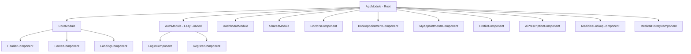
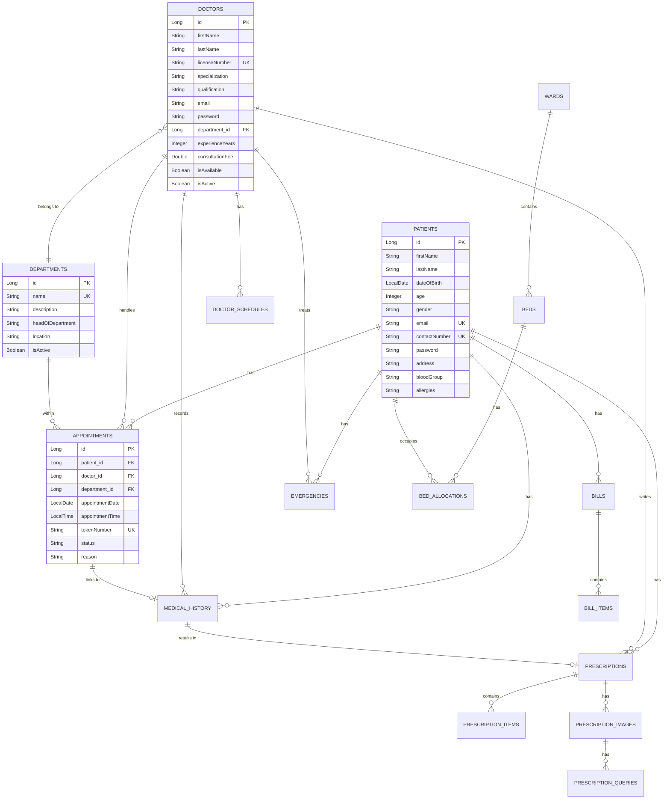
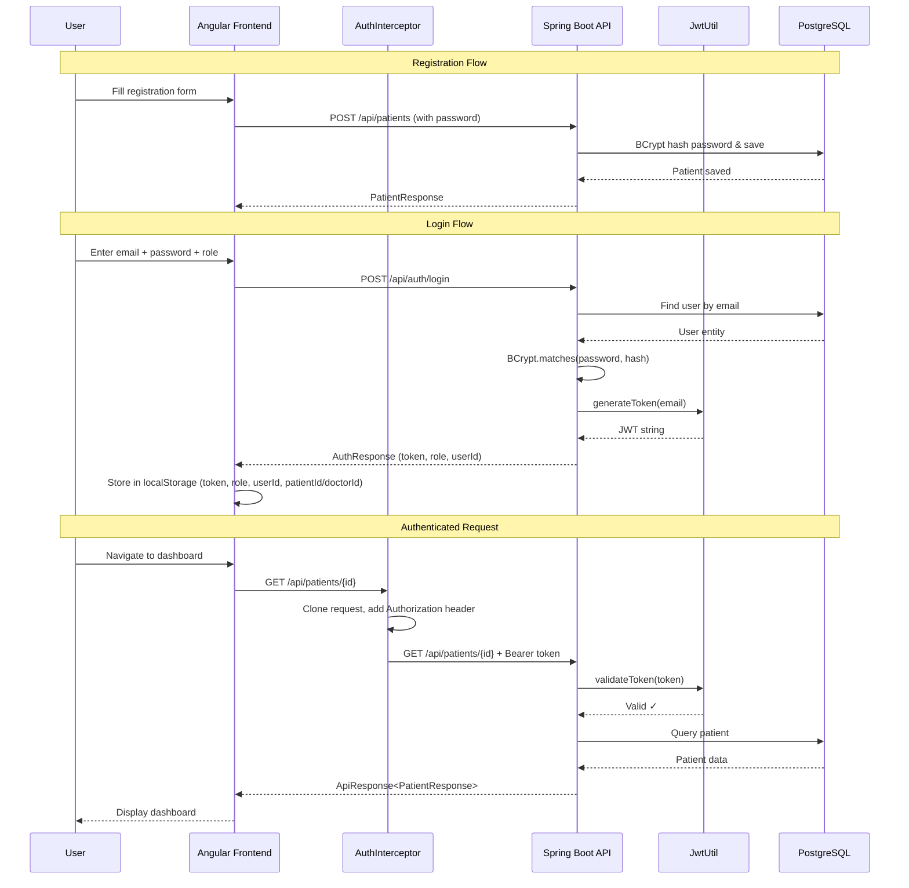

# 🏥 Healthcare Management System — Complete Project Document

> **Project Name:** Hospital Management System with AI  
> **Version:** 1.0.0  
> **Architecture:** Full-Stack (Spring Boot + Angular)  
> **Last Updated:** April 11, 2026

---

## Table of Contents

1. [Project Overview](#1-project-overview)
2. [Technology Stack](#2-technology-stack)
3. [Project Structure](#3-project-structure)
4. [Backend (Spring Boot)](#4-backend-spring-boot)
   - 4.1 [Configuration](#41-configuration)
   - 4.2 [Entity Layer (Database Models)](#42-entity-layer-database-models)
   - 4.3 [DTO Layer (Data Transfer Objects)](#43-dto-layer-data-transfer-objects)
   - 4.4 [Repository Layer](#44-repository-layer)
   - 4.5 [RepositoryBean Layer (Business Logic/Service)](#45-repositorybean-layer-business-logicservice)
   - 4.6 [Controller Layer (REST APIs)](#46-controller-layer-rest-apis)
   - 4.7 [Security & Authentication](#47-security--authentication)
   - 4.8 [Exception Handling](#48-exception-handling)
   - 4.9 [AI Integration (Gemini)](#49-ai-integration-gemini)
   - 4.10 [Swagger/OpenAPI Documentation](#410-swaggeropenapi-documentation)
5. [Frontend (Angular)](#5-frontend-angular)
   - 5.1 [Configuration](#51-configuration)
   - 5.2 [Module Architecture](#52-module-architecture)
   - 5.3 [Routing & Navigation](#53-routing--navigation)
   - 5.4 [Services Layer](#54-services-layer)
   - 5.5 [Interceptors](#55-interceptors)
   - 5.6 [Guards](#56-guards)
   - 5.7 [Feature Components](#57-feature-components)
6. [Database Schema (ER Diagram)](#6-database-schema-er-diagram)
7. [Complete API Reference](#7-complete-api-reference)
8. [Authentication Flow](#8-authentication-flow)
9. [Role-Based Access (PATIENT vs DOCTOR)](#9-role-based-access-patient-vs-doctor)
10. [How to Run the Project](#10-how-to-run-the-project)

---

## 1. Project Overview

This is a **full-stack Hospital Management System** that provides:

- **Patient Management** — Registration, profiles, medical history
- **Doctor Management** — Registration, specialization, availability toggling
- **Appointment Booking** — Token-based scheduling system
- **Department Management** — Organizing doctors by departments
- **Billing** — Bills, bill items, payment tracking
- **Prescriptions** — Doctor-issued prescriptions with medicine items
- **Medicine Inventory** — Stock tracking with reorder levels
- **Ward & Bed Management** — Ward types, bed allocation
- **Emergency Services** — Severity-based emergency management
- **AI-Powered Features** — Prescription scanning & analysis using Google Gemini AI
- **Role-Based Dashboards** — Separate dashboards for Patients and Doctors
- **JWT Authentication** — Stateless security with Bearer tokens

---

## 2. Technology Stack

### Backend

| Technology | Version | Purpose |
|---|---|---|
| **Java** | 17 | Programming language |
| **Spring Boot** | 3.2.0 | Application framework |
| **Spring Data JPA** | (via starter) | ORM & database access |
| **Spring Security** | (via starter) | Authentication & authorization |
| **PostgreSQL** | Latest | Relational database |
| **Lombok** | 1.18.38 | Boilerplate code reduction |
| **JJWT** | 0.11.5 | JSON Web Token generation & validation |
| **SpringDoc OpenAPI** | 2.2.0 | Swagger/API documentation |
| **Jakarta Validation** | (via starter) | Input validation |
| **Maven** | (wrapper) | Build tool |

### Frontend

| Technology | Version | Purpose |
|---|---|---|
| **Angular** | 19.2.0 | SPA framework |
| **TypeScript** | 5.7.2 | Programming language |
| **RxJS** | 7.8.x | Reactive programming |
| **Angular SSR** | 19.2.20 | Server-side rendering support |
| **Express** | 4.18.2 | SSR server |
| **Karma + Jasmine** | Latest | Testing framework |

---

## 3. Project Structure

### Root Directory

```
HealthCare/
├── pom.xml                          # Maven build config
├── mvnw / mvnw.cmd                  # Maven wrapper
├── src/
│   ├── main/
│   │   ├── java/com/hospital/hospitalapi/
│   │   │   ├── HospitalapiApplication.java     # Main Spring Boot entry point
│   │   │   ├── HelloController.java            # Health check endpoint
│   │   │   ├── config/                         # Configuration classes
│   │   │   ├── controller/                     # REST controllers
│   │   │   ├── dto/                            # Request/Response DTOs
│   │   │   ├── entity/                         # JPA entity models
│   │   │   ├── exception/                      # Custom exceptions + handler
│   │   │   ├── repository/                     # JPA repositories (interfaces)
│   │   │   ├── repositorybean/                 # Business logic services
│   │   │   └── security/                       # JWT auth filter & utility
│   │   └── resources/
│   │       └── application.properties          # App configuration
│   └── test/                                   # Unit tests
├── uploads/                                    # Uploaded prescription images
└── UserProject/                                # Angular frontend
    ├── package.json
    ├── angular.json
    ├── tsconfig.json
    └── src/
        ├── main.ts / main.server.ts / server.ts
        ├── index.html
        ├── styles.css
        ├── environments/
        │   └── environment.ts
        └── app/
            ├── app.module.ts                   # Root module
            ├── app.component.ts/html/css
            ├── auth/                           # Auth module (login/register)
            ├── core/                           # Core module (header/footer/landing)
            ├── dashboard/                      # Dashboard module
            ├── profile/                        # Profile component
            ├── doctors/                        # Doctors listing
            ├── appointments/                   # Booking & my-appointments
            ├── ai-prescription/                # AI prescription scanner
            ├── medicine-lookup/                # AI medicine lookup
            ├── medical-history/                # Medical history timeline
            ├── services/                       # Angular services (HTTP)
            ├── interceptors/                   # HTTP interceptors
            ├── guards/                         # Route guards
            └── shared/                         # Shared module
```

---

## 4. Backend (Spring Boot)

### 4.1 Configuration

#### [application.properties](file:///c:/Users/Narvesh/Documents/Healthcare_fsd/HealthCare/src/main/resources/application.properties)

| Property | Value | Description |
|---|---|---|
| `server.port` | `8080` | Server runs on port 8080 |
| `spring.datasource.url` | `jdbc:postgresql://localhost:5432/hospitaldb` | PostgreSQL database URL |
| `spring.datasource.username` | `postgres` | DB username |
| `spring.jpa.hibernate.ddl-auto` | [update](file:///c:/Users/Narvesh/Documents/Healthcare_fsd/HealthCare/src/main/java/com/hospital/hospitalapi/controller/DoctorController.java#82-90) | Auto-creates/updates tables |
| `gemini.api.url` | `https://generativelanguage.googleapis.com/...` | Gemini AI base URL |
| `jwt.secret` | `ChangeThisToAStrongSecretKeyForJwtSigning` | JWT signing secret |
| `jwt.expiration-ms` | `3600000` | JWT expires in 1 hour |
| `springdoc.swagger-ui.path` | `/swagger-ui.html` | Swagger UI URL |
| `spring.servlet.multipart.max-file-size` | `5MB` | Max upload file size |

#### [CorsConfig.java](file:///c:/Users/Narvesh/Documents/Healthcare_fsd/HealthCare/src/main/java/com/hospital/hospitalapi/config/CorsConfig.java)

Allows all origins, headers, and methods for cross-origin requests from the Angular frontend.

```java
config.setAllowCredentials(true);
config.addAllowedOriginPattern("*");
config.addAllowedHeader("*");
config.addAllowedMethod("*");
```

#### [SwaggerConfig.java](file:///c:/Users/Narvesh/Documents/Healthcare_fsd/HealthCare/src/main/java/com/hospital/hospitalapi/config/SwaggerConfig.java)

Configures Swagger/OpenAPI documentation titled "Hospital Management System API" v1.0.

---

### 4.2 Entity Layer (Database Models)

All entities use Lombok (`@Data`, `@NoArgsConstructor`, `@AllArgsConstructor`) and JPA annotations. Located in `com.hospital.hospitalapi.entity`.

#### 4.2.1 Patient

**File:** [Patient.java](file:///c:/Users/Narvesh/Documents/Healthcare_fsd/HealthCare/src/main/java/com/hospital/hospitalapi/entity/Patient.java) | **Table:** `patients`

| Column | Type | Constraints | Description |
|---|---|---|---|
| [id](file:///c:/Users/Narvesh/Documents/Healthcare_fsd/HealthCare/src/main/java/com/hospital/hospitalapi/security/JwtUtil.java#42-50) | `Long` | PK, Auto-generated | Primary key |
| `firstName` | `String(100)` | NOT NULL | Patient's first name |
| `lastName` | `String(100)` | NOT NULL | Patient's last name |
| `dateOfBirth` | `LocalDate` | NOT NULL | Date of birth |
| [age](file:///c:/Users/Narvesh/Documents/Healthcare_fsd/HealthCare/UserProject/src/app/services/ai.service.ts#21-26) | `Integer` | NOT NULL | Auto-calculated from DOB |
| `gender` | `String(10)` | NOT NULL | Gender |
| `contactNumber` | `String(15)` | UNIQUE | Phone number |
| `email` | `String(100)` | UNIQUE | Email address |
| [password](file:///c:/Users/Narvesh/Documents/Healthcare_fsd/HealthCare/src/main/java/com/hospital/hospitalapi/config/SecurityConfig.java#21-25) | `String(200)` | — | Hashed password (write-only via `@JsonProperty`) |
| `address` | `TEXT` | — | Full address |
| `bloodGroup` | `String(50)` | — | Blood group (A+, B-, etc.) |
| `allergies` | `TEXT` | — | Known allergies |
| `emergencyContactName` | `String(50)` | — | Emergency contact name |
| `emergencyContactNumber` | `String(15)` | — | Emergency contact phone |
| `createdAt` | `LocalDateTime` | NOT NULL, immutable | Record creation time |
| `updatedAt` | `LocalDateTime` | NOT NULL | Last update time |

**Special behavior:** Age is auto-calculated from `dateOfBirth` on `@PrePersist` and `@PreUpdate`.

---

#### 4.2.2 Doctor

**File:** [Doctor.java](file:///c:/Users/Narvesh/Documents/Healthcare_fsd/HealthCare/src/main/java/com/hospital/hospitalapi/entity/Doctor.java) | **Table:** `doctors`

| Column | Type | Constraints | Description |
|---|---|---|---|
| [id](file:///c:/Users/Narvesh/Documents/Healthcare_fsd/HealthCare/src/main/java/com/hospital/hospitalapi/security/JwtUtil.java#42-50) | `Long` | PK, Auto-generated | Primary key |
| `firstName` | `String(100)` | NOT NULL | Doctor's first name |
| `lastName` | `String(100)` | NOT NULL | Doctor's last name |
| `licenseNumber` | `String(50)` | NOT NULL, UNIQUE | Medical license |
| `specialization` | `String(100)` | NOT NULL | e.g., Cardiology, Neurology |
| `qualification` | `String(100)` | NOT NULL | e.g., MBBS, MD |
| `contactNumber` | `String(15)` | — | Phone number |
| `email` | `String(100)` | — | Email |
| [password](file:///c:/Users/Narvesh/Documents/Healthcare_fsd/HealthCare/src/main/java/com/hospital/hospitalapi/config/SecurityConfig.java#21-25) | `String(200)` | — | Hashed password (write-only) |
| `department` | [Department](file:///c:/Users/Narvesh/Documents/Healthcare_fsd/HealthCare/src/main/java/com/hospital/hospitalapi/entity/Department.java#9-49) (FK) | NOT NULL | ManyToOne relationship |
| `experienceYears` | `Integer` | NOT NULL | Years of experience |
| `consultationFee` | `Double` | NOT NULL | Fee per consultation |
| `isAvailable` | `Boolean` | NOT NULL, default `true` | Currently available? |
| `isActive` | `Boolean` | NOT NULL, default `true` | Soft-delete flag |
| `createdAt / updatedAt` | `LocalDateTime` | — | Timestamps |

---

#### 4.2.3 Department

**File:** [Department.java](file:///c:/Users/Narvesh/Documents/Healthcare_fsd/HealthCare/src/main/java/com/hospital/hospitalapi/entity/Department.java) | **Table:** `departments`

| Column | Type | Constraints |
|---|---|---|
| [id](file:///c:/Users/Narvesh/Documents/Healthcare_fsd/HealthCare/src/main/java/com/hospital/hospitalapi/security/JwtUtil.java#42-50) | `Long` | PK |
| `name` | `String(100)` | NOT NULL, UNIQUE |
| `description` | `TEXT` | — |
| `headOfDepartment` | `String(50)` | — |
| `contactNumber` | `String(15)` | — |
| `location` | `String(100)` | — |
| `isActive` | `Boolean` | NOT NULL, default `true` |

---

#### 4.2.4 Appointment

**File:** [Appointment.java](file:///c:/Users/Narvesh/Documents/Healthcare_fsd/HealthCare/src/main/java/com/hospital/hospitalapi/entity/Appointment.java) | **Table:** `appointments`

| Column | Type | Constraints | Description |
|---|---|---|---|
| [id](file:///c:/Users/Narvesh/Documents/Healthcare_fsd/HealthCare/src/main/java/com/hospital/hospitalapi/security/JwtUtil.java#42-50) | `Long` | PK | — |
| `patient` | [Patient](file:///c:/Users/Narvesh/Documents/Healthcare_fsd/HealthCare/src/main/java/com/hospital/hospitalapi/entity/Patient.java#12-94) (FK) | NOT NULL | ManyToOne |
| `doctor` | [Doctor](file:///c:/Users/Narvesh/Documents/Healthcare_fsd/HealthCare/src/main/java/com/hospital/hospitalapi/entity/Doctor.java#9-84) (FK) | NOT NULL | ManyToOne |
| `department` | [Department](file:///c:/Users/Narvesh/Documents/Healthcare_fsd/HealthCare/src/main/java/com/hospital/hospitalapi/entity/Department.java#9-49) (FK) | NOT NULL | ManyToOne |
| `appointmentDate` | `LocalDate` | NOT NULL | Date of appointment |
| `appointmentTime` | `LocalTime` | NOT NULL | Time of appointment |
| `tokenNumber` | `String(50)` | NOT NULL, UNIQUE | Auto-generated (e.g., `TKN-A1B2C3D4E5F6`) |
| `status` | `String(20)` | NOT NULL | `SCHEDULED`, `COMPLETED`, `CANCELLED`, `NO_SHOW` |
| `reason` | `TEXT` | — | Reason for visit |
| `notes` | `TEXT` | — | Additional notes |

**Token generation:** Uses UUID → `"TKN-" + UUID.randomUUID().substring(0,12).toUpperCase()`

---

#### 4.2.5 MedicalHistory

**File:** [MedicalHistory.java](file:///c:/Users/Narvesh/Documents/Healthcare_fsd/HealthCare/src/main/java/com/hospital/hospitalapi/entity/MedicalHistory.java) | **Table:** `medical_history`

| Column | Type | Constraints |
|---|---|---|
| [id](file:///c:/Users/Narvesh/Documents/Healthcare_fsd/HealthCare/src/main/java/com/hospital/hospitalapi/security/JwtUtil.java#42-50) | `Long` | PK |
| `patient` | [Patient](file:///c:/Users/Narvesh/Documents/Healthcare_fsd/HealthCare/src/main/java/com/hospital/hospitalapi/entity/Patient.java#12-94) (FK) | NOT NULL |
| `doctor` | [Doctor](file:///c:/Users/Narvesh/Documents/Healthcare_fsd/HealthCare/src/main/java/com/hospital/hospitalapi/entity/Doctor.java#9-84) (FK) | NOT NULL |
| `appointment` | [Appointment](file:///c:/Users/Narvesh/Documents/Healthcare_fsd/HealthCare/src/main/java/com/hospital/hospitalapi/entity/Appointment.java#11-63) (FK) | Optional |
| `visitDate` | `LocalDateTime` | NOT NULL |
| `symptoms` | `TEXT` | NOT NULL |
| `diagnosis` | `TEXT` | NOT NULL |
| `treatment` | `TEXT` | — |
| `bloodPressure` | `String(20)` | — |
| `temperature` | `Double` | — |
| `pulse` | `Integer` | — |
| `weight` | `Double` | — |
| `height` | `Double` | — |
| `notes` | `TEXT` | — |

---

#### 4.2.6 Medicine

**File:** [Medicine.java](file:///c:/Users/Narvesh/Documents/Healthcare_fsd/HealthCare/src/main/java/com/hospital/hospitalapi/entity/Medicine.java) | **Table:** `medicines`

| Column | Type | Constraints |
|---|---|---|
| [id](file:///c:/Users/Narvesh/Documents/Healthcare_fsd/HealthCare/src/main/java/com/hospital/hospitalapi/security/JwtUtil.java#42-50) | `Long` | PK |
| `name` | `String(100)` | NOT NULL, UNIQUE |
| `genericName` | `String(100)` | — |
| `category` | `String(100)` | NOT NULL |
| `manufacturer` | `String(50)` | NOT NULL |
| `unitPrice` | `Double` | NOT NULL |
| `stockQuantity` | `Integer` | NOT NULL |
| `reorderLevel` | `Integer` | NOT NULL |
| `expiryDate` | `LocalDate` | — |
| `description` | `TEXT` | — |
| `sideEffects` | `TEXT` | — |
| `isActive` | `Boolean` | NOT NULL |

---

#### 4.2.7 Bill & BillItem

**File:** [Bill.java](file:///c:/Users/Narvesh/Documents/Healthcare_fsd/HealthCare/src/main/java/com/hospital/hospitalapi/entity/Bill.java) | **Table:** `bills`

| Column | Type | Description |
|---|---|---|
| [id](file:///c:/Users/Narvesh/Documents/Healthcare_fsd/HealthCare/src/main/java/com/hospital/hospitalapi/security/JwtUtil.java#42-50) | `Long` | PK |
| `patient` | [Patient](file:///c:/Users/Narvesh/Documents/Healthcare_fsd/HealthCare/src/main/java/com/hospital/hospitalapi/entity/Patient.java#12-94) (FK) | Billed patient |
| `billNumber` | `String(50)` | Unique bill number |
| `billDate` | `LocalDateTime` | Date of billing |
| `totalAmount` | `Double` | Total amount |
| `paidAmount` | `Double` | Amount paid (default `0.0`) |
| `balanceAmount` | `Double` | Remaining balance |
| `paymentStatus` | `String(20)` | `PENDING`, `PARTIAL`, `PAID` |
| `items` | `List<BillItem>` | OneToMany (cascade ALL) |

---

#### 4.2.8 Prescription & PrescriptionItem

**File:** [Prescription.java](file:///c:/Users/Narvesh/Documents/Healthcare_fsd/HealthCare/src/main/java/com/hospital/hospitalapi/entity/Prescription.java) | **Table:** `prescriptions`

| Column | Type | Description |
|---|---|---|
| [id](file:///c:/Users/Narvesh/Documents/Healthcare_fsd/HealthCare/src/main/java/com/hospital/hospitalapi/security/JwtUtil.java#42-50) | `Long` | PK |
| `patient` | [Patient](file:///c:/Users/Narvesh/Documents/Healthcare_fsd/HealthCare/src/main/java/com/hospital/hospitalapi/entity/Patient.java#12-94) (FK) | Patient |
| `doctor` | [Doctor](file:///c:/Users/Narvesh/Documents/Healthcare_fsd/HealthCare/src/main/java/com/hospital/hospitalapi/entity/Doctor.java#9-84) (FK) | Prescribing doctor |
| `medicalHistory` | [MedicalHistory](file:///c:/Users/Narvesh/Documents/Healthcare_fsd/HealthCare/src/main/java/com/hospital/hospitalapi/entity/MedicalHistory.java#9-73) (FK) | Optional linked visit |
| `prescriptionDate` | `LocalDateTime` | When prescribed |
| `diagnosis` | `TEXT` | Diagnosis |
| `instructions` | `TEXT` | Usage instructions |
| `followUpInstructions` | `TEXT` | Follow-up notes |
| `items` | `List<PrescriptionItem>` | OneToMany (cascade ALL) |

---

#### 4.2.9 Emergency

**File:** [Emergency.java](file:///c:/Users/Narvesh/Documents/Healthcare_fsd/HealthCare/src/main/java/com/hospital/hospitalapi/entity/Emergency.java) | **Table:** `emergencies`

| Column | Type | Description |
|---|---|---|
| [id](file:///c:/Users/Narvesh/Documents/Healthcare_fsd/HealthCare/src/main/java/com/hospital/hospitalapi/security/JwtUtil.java#42-50) | `Long` | PK |
| `patient` | [Patient](file:///c:/Users/Narvesh/Documents/Healthcare_fsd/HealthCare/src/main/java/com/hospital/hospitalapi/entity/Patient.java#12-94) (FK) | Patient in emergency |
| `doctor` | [Doctor](file:///c:/Users/Narvesh/Documents/Healthcare_fsd/HealthCare/src/main/java/com/hospital/hospitalapi/entity/Doctor.java#9-84) (FK) | Assigned doctor (optional) |
| `arrivalTime` | `LocalDateTime` | When patient arrived |
| `severity` | `String(20)` | `CRITICAL`, `MODERATE`, `MINOR` |
| `chiefComplaint` | `TEXT` | Primary complaint |
| `initialAssessment` | `TEXT` | Initial assessment |
| `status` | `String(20)` | `WAITING`, `IN_TREATMENT`, `ADMITTED`, `DISCHARGED`, `TRANSFERRED` |
| `treatmentStartTime` | `LocalDateTime` | When treatment started |
| `dischargeTime` | `LocalDateTime` | When discharged |
| `treatmentNotes` | `TEXT` | Treatment details |

---

#### 4.2.10 Ward & Bed

**File:** [Ward.java](file:///c:/Users/Narvesh/Documents/Healthcare_fsd/HealthCare/src/main/java/com/hospital/hospitalapi/entity/Ward.java) | **Table:** `wards`

| Column | Type | Description |
|---|---|---|
| `wardNumber` | `String(50)` | Unique ward number |
| `wardType` | `String(50)` | `GENERAL`, `PRIVATE`, `ICU`, `EMERGENCY` |
| `totalBeds` | `Integer` | Total beds in ward |
| `availableBeds` | `Integer` | Currently available |
| `chargesPerDay` | `Double` | Daily charges |

**File:** [Bed.java](file:///c:/Users/Narvesh/Documents/Healthcare_fsd/HealthCare/src/main/java/com/hospital/hospitalapi/entity/Bed.java) | **Table:** `beds`

| Column | Type | Description |
|---|---|---|
| `ward` | [Ward](file:///c:/Users/Narvesh/Documents/Healthcare_fsd/HealthCare/src/main/java/com/hospital/hospitalapi/entity/Ward.java#9-52) (FK) | Which ward this bed belongs to |
| `bedNumber` | `String(20)` | Unique bed number |
| `status` | `String(20)` | `AVAILABLE`, `OCCUPIED`, `MAINTENANCE`, `RESERVED` |

---

#### 4.2.11 AI Entities

- **[PrescriptionImage](file:///c:/Users/Narvesh/Documents/Healthcare_fsd/HealthCare/src/main/java/com/hospital/hospitalapi/controller/ai/AIPrescriptionController.java#55-70)** — Stores uploaded prescription images and their AI analysis results (extracted text, analyzed medicines, confidence score)
- **`PrescriptionQuery`** — Stores Q&A chat history between user and AI about a prescription

---

### 4.3 DTO Layer (Data Transfer Objects)

Located in `com.hospital.hospitalapi.dto`.

#### Request DTOs (`dto/request/`)

| DTO | Used For |
|---|---|
| [PatientRequest](file:///c:/Users/Narvesh/Documents/Healthcare_fsd/HealthCare/UserProject/src/app/services/auth.service.ts#21-35) | Creating/updating patients |
| `DoctorRequest` | Creating/updating doctors (includes `departmentId`) |
| [AppointmentRequest](file:///c:/Users/Narvesh/Documents/Healthcare_fsd/HealthCare/UserProject/src/app/services/appointment.service.ts#6-15) | Booking appointments (includes `patientId`, `doctorId`, `departmentId`) |
| `DepartmentRequest` | Creating/updating departments |
| [LoginRequest](file:///c:/Users/Narvesh/Documents/Healthcare_fsd/HealthCare/UserProject/src/app/services/auth.service.ts#8-13) | Login (email, password, role) |
| `MedicalHistoryRequest` | Recording medical history |
| `MedicineRequest` | Managing medicines |
| `PrescriptionRequest` / `PrescriptionItemRequest` | Creating prescriptions |
| `BillRequest` / `BillItemRequest` | Creating bills |
| `BedRequest` / `BedAllocationRequest` | Managing beds |
| `WardRequest` | Managing wards |
| `EmergencyRequest` | Registering emergencies |
| `DoctorScheduleRequest` | Setting doctor schedules |
| `PaymentRequest` | Processing payments |
| `PrescriptionQuestionRequest` (AI) | Asking AI about a prescription |
| `MedicineCompareRequest` (AI) | Comparing medicines via AI |

#### Response DTOs (`dto/response/`)

**ApiResponse\<T\>** — Standard wrapper for all API responses:

```java
public class ApiResponse<T> {
    private Boolean success;       // true/false
    private String message;        // Human-readable message
    private T data;                // Response payload
    private LocalDateTime timestamp; // When response was created
}
```

**AuthResponse** — Login response:

```java
public class AuthResponse {
    private String token;      // JWT token
    private Long patientId;    // Kept for backward compatibility
    private String role;       // "PATIENT" or "DOCTOR"
    private Long userId;       // Generic user ID
}
```

Other response DTOs: [PatientResponse](file:///c:/Users/Narvesh/Documents/Healthcare_fsd/HealthCare/UserProject/src/app/services/patient.service.ts#6-23), [DoctorResponse](file:///c:/Users/Narvesh/Documents/Healthcare_fsd/HealthCare/UserProject/src/app/services/doctor.service.ts#6-23), [AppointmentResponse](file:///c:/Users/Narvesh/Documents/Healthcare_fsd/HealthCare/UserProject/src/app/services/appointment.service.ts#16-29), `DepartmentResponse`, [MedicalHistoryResponse](file:///c:/Users/Narvesh/Documents/Healthcare_fsd/HealthCare/UserProject/src/app/services/medical-history.service.ts#6-21), `MedicineResponse`, `BillResponse`, `BillItemResponse`, `PrescriptionResponse`, `PrescriptionItemResponse`, `EmergencyResponse`.

AI-specific responses: `PrescriptionAnalysisResponse`, `PrescriptionAnswerResponse`, `ChatHistoryResponse`, `MedicineInfoResponse`.

---

### 4.4 Repository Layer

JPA repository interfaces located in `com.hospital.hospitalapi.repository`. Each extends `JpaRepository<Entity, Long>`.

| Repository | Entity | Custom Methods |
|---|---|---|
| `PatientRepository` | [Patient](file:///c:/Users/Narvesh/Documents/Healthcare_fsd/HealthCare/src/main/java/com/hospital/hospitalapi/entity/Patient.java#12-94) | `findByEmail()`, search methods |
| `DoctorRepository` | [Doctor](file:///c:/Users/Narvesh/Documents/Healthcare_fsd/HealthCare/src/main/java/com/hospital/hospitalapi/entity/Doctor.java#9-84) | `findByEmail()`, `findByDepartment()`, `findBySpecialization()`, availability/active filters |
| [AppointmentRepository](file:///c:/Users/Narvesh/Documents/Healthcare_fsd/HealthCare/src/main/java/com/hospital/hospitalapi/repositorybean/AppointmentRepositoryBean.java#14-91) | [Appointment](file:///c:/Users/Narvesh/Documents/Healthcare_fsd/HealthCare/src/main/java/com/hospital/hospitalapi/entity/Appointment.java#11-63) | `findByPatient()`, `findByDoctor()`, `findByAppointmentDate()` |
| `DepartmentRepository` | [Department](file:///c:/Users/Narvesh/Documents/Healthcare_fsd/HealthCare/src/main/java/com/hospital/hospitalapi/entity/Department.java#9-49) | Standard CRUD |
| `MedicalHistoryRepository` | [MedicalHistory](file:///c:/Users/Narvesh/Documents/Healthcare_fsd/HealthCare/src/main/java/com/hospital/hospitalapi/entity/MedicalHistory.java#9-73) | `findByPatient()`, `findByDoctor()` |
| `MedicineRepository` | [Medicine](file:///c:/Users/Narvesh/Documents/Healthcare_fsd/HealthCare/src/main/java/com/hospital/hospitalapi/entity/Medicine.java#10-65) | Stock management queries |
| `BillRepository` | [Bill](file:///c:/Users/Narvesh/Documents/Healthcare_fsd/HealthCare/src/main/java/com/hospital/hospitalapi/entity/Bill.java#10-57) | `findByPatient()`, payment status |
| `BillItemRepository` | `BillItem` | Standard CRUD |
| `PrescriptionRepository` | [Prescription](file:///c:/Users/Narvesh/Documents/Healthcare_fsd/HealthCare/src/main/java/com/hospital/hospitalapi/entity/Prescription.java#10-59) | `findByPatient()`, `findByDoctor()` |
| `PrescriptionItemRepository` | `PrescriptionItem` | Standard CRUD |
| `EmergencyRepository` | [Emergency](file:///c:/Users/Narvesh/Documents/Healthcare_fsd/HealthCare/src/main/java/com/hospital/hospitalapi/entity/Emergency.java#9-63) | `findByPatient()`, status filters |
| `WardRepository` | [Ward](file:///c:/Users/Narvesh/Documents/Healthcare_fsd/HealthCare/src/main/java/com/hospital/hospitalapi/entity/Ward.java#9-52) | Active wards |
| `BedRepository` | [Bed](file:///c:/Users/Narvesh/Documents/Healthcare_fsd/HealthCare/src/main/java/com/hospital/hospitalapi/entity/Bed.java#9-44) | Available beds, status |
| `BedAllocationRepository` | `BedAllocation` | Active allocations |
| `DoctorScheduleRepository` | `DoctorSchedule` | Schedule queries |
| `PrescriptionImageRepository` (AI) | [PrescriptionImage](file:///c:/Users/Narvesh/Documents/Healthcare_fsd/HealthCare/src/main/java/com/hospital/hospitalapi/controller/ai/AIPrescriptionController.java#55-70) | By prescription, by patient |
| `PrescriptionQueryRepository` (AI) | `PrescriptionQuery` | Chat history |

---

### 4.5 RepositoryBean Layer (Business Logic/Service)

> [!IMPORTANT]
> This project uses a **non-standard "RepositoryBean" pattern** instead of the traditional Service layer. Each [RepositoryBean](file:///c:/Users/Narvesh/Documents/Healthcare_fsd/HealthCare/src/main/java/com/hospital/hospitalapi/repositorybean/AppointmentRepositoryBean.java#14-91) class is annotated with `@Service` and contains the business logic, acting as an intermediary between controllers and repositories.

Located in `com.hospital.hospitalapi.repositorybean`.

| RepositoryBean | Responsibilities |
|---|---|
| `PatientRepositoryBean` | Patient CRUD, search, password encryption |
| `DoctorRepositoryBean` | Doctor CRUD, availability management, department linking, activation/deactivation |
| [AppointmentRepositoryBean](file:///c:/Users/Narvesh/Documents/Healthcare_fsd/HealthCare/src/main/java/com/hospital/hospitalapi/repositorybean/AppointmentRepositoryBean.java#14-91) | Booking (with auto token generation), status updates, cancellation |
| `DepartmentRepositoryBean` | Department CRUD |
| `MedicalHistoryRepositoryBean` | History CRUD, patient history retrieval |
| `MedicineRepositoryBean` | Medicine CRUD, stock management |
| `BillRepositoryBean` | Billing, payment processing |
| `PrescriptionRepositoryBean` | Prescription creation with items |
| `EmergencyRepositoryBean` | Emergency management |
| `WardRepositoryBean` | Ward CRUD |
| `BedRepositoryBean` | Bed management |
| `BedAllocationRepositoryBean` | Bed allocation/deallocation |

#### AI RepositoryBeans (`repositorybean/ai/`)

| RepositoryBean | Responsibilities |
|---|---|
| `PrescriptionAnalysisRepositoryBean` | Upload & AI analysis of prescription images |
| `PrescriptionChatRepositoryBean` | Q&A about prescriptions using Gemini AI |
| `GeminiIntegrationRepositoryBean` | Direct Gemini API integration for medicine info |

**Example — AppointmentRepositoryBean:**

```java
@Service
@RequiredArgsConstructor
public class AppointmentRepositoryBean {
    private final AppointmentRepository appointmentRepository;
    private final PatientRepositoryBean patientRepositoryBean;
    private final DoctorRepositoryBean doctorRepositoryBean;
    private final DepartmentRepositoryBean departmentRepositoryBean;

    @Transactional
    public Appointment createAppointment(Appointment appointment, Long patientId, Long doctorId, Long departmentId) {
        Patient patient = patientRepositoryBean.getPatientById(patientId);
        Doctor doctor = doctorRepositoryBean.getDoctorById(doctorId);
        Department department = departmentRepositoryBean.getDepartmentById(departmentId);

        appointment.setPatient(patient);
        appointment.setDoctor(doctor);
        appointment.setDepartment(department);
        appointment.setTokenNumber("TKN-" + UUID.randomUUID().toString().substring(0, 12).toUpperCase());
        appointment.setStatus("SCHEDULED");

        return appointmentRepository.save(appointment);
    }
}
```

---

### 4.6 Controller Layer (REST APIs)

All controllers use `@RestController` and return `ApiResponse<T>`. Located in `com.hospital.hospitalapi.controller`.

| Controller | Base Path | Endpoints |
|---|---|---|
| **AuthController** | `/api/auth` | `POST /login`, `POST /register/doctor` |
| **PatientController** | `/api/patients` | CRUD + search |
| **DoctorController** | `/api/doctors` | CRUD + by department/specialization + availability toggle + activate/deactivate |
| **AppointmentController** | `/api/appointments` | Book, get by patient/doctor, today's, complete, cancel |
| **DepartmentController** | `/api/departments` | CRUD |
| **MedicalHistoryController** | `/api/medical-history` | CRUD + by patient, recent history |
| **MedicineController** | `/api/medicines` | CRUD + stock management |
| **BillController** | `/api/bills` | Create, pay, get by patient |
| **PrescriptionController** | `/api/prescriptions` | CRUD + by patient/doctor |
| **EmergencyController** | `/api/emergencies` | CRUD + status management |
| **AIPrescriptionController** | `/api/ai/prescriptions` | Upload image, get analysis, ask questions, chat history, medicine info |

---

### 4.7 Security & Authentication

#### JWT Generation — [JwtUtil.java](file:///c:/Users/Narvesh/Documents/Healthcare_fsd/HealthCare/src/main/java/com/hospital/hospitalapi/security/JwtUtil.java)

```java
@Component
public class JwtUtil {
    private Key key;  // HMAC-SHA256 key derived from secret

    public String generateToken(String subject) { ... }   // Creates JWT with 1hr expiry
    public boolean validateToken(String token) { ... }     // Validates JWT signature
    public String getSubject(String token) { ... }         // Extracts email from JWT
}
```

#### JWT Filter — [JwtAuthenticationFilter.java](file:///c:/Users/Narvesh/Documents/Healthcare_fsd/HealthCare/src/main/java/com/hospital/hospitalapi/security/JwtAuthenticationFilter.java)

Extends `OncePerRequestFilter`. For every request:

1. Extracts `Authorization: Bearer <token>` header
2. Validates the JWT token
3. Sets `SecurityContextHolder` authentication if valid
4. Passes request to next filter

#### Security Config — [SecurityConfig.java](file:///c:/Users/Narvesh/Documents/Healthcare_fsd/HealthCare/src/main/java/com/hospital/hospitalapi/config/SecurityConfig.java)

```
Public endpoints (no auth required):
  ├── /api/auth/**           (login, register)
  ├── /api/patients          (patient registration - POST)
  ├── /api/departments       (list departments)
  ├── /api/doctors           (list doctors)
  ├── /swagger-ui/**         (API docs)
  └── /v3/api-docs/**        (OpenAPI spec)

All other endpoints → require valid JWT token
```

- **CSRF**: Disabled (stateless API)
- **Session**: `STATELESS` (no server-side sessions)
- **Password hashing**: `BCryptPasswordEncoder`

---

### 4.8 Exception Handling

#### [GlobalExceptionHandler.java](file:///c:/Users/Narvesh/Documents/Healthcare_fsd/HealthCare/src/main/java/com/hospital/hospitalapi/exception/GlobalExceptionHandler.java)

Uses `@RestControllerAdvice` to catch all exceptions globally and return proper HTTP status codes:

| Exception | HTTP Status | When |
|---|---|---|
| `PatientNotFoundException` | 404 | Patient ID not found |
| `DoctorNotFoundException` | 404 | Doctor ID not found |
| `DepartmentNotFoundException` | 404 | Department ID not found |
| `AppointmentNotFoundException` | 404 | Appointment ID not found |
| `MedicineNotFoundException` | 404 | Medicine not found |
| `PrescriptionNotFoundException` | 404 | Prescription not found |
| `BillNotFoundException` | 404 | Bill not found |
| `BedNotAvailableException` | 409 (Conflict) | No beds available |
| `InsufficientStockException` | 409 (Conflict) | Medicine out of stock |
| `InvalidScheduleException` | 400 (Bad Request) | Invalid schedule data |
| `DuplicateResourceException` | 409 (Conflict) | Duplicate entry |
| `ImageAnalysisFailedException` | 500 (Internal Error) | AI image analysis failed |
| [AIServiceException](file:///c:/Users/Narvesh/Documents/Healthcare_fsd/HealthCare/src/main/java/com/hospital/hospitalapi/exception/GlobalExceptionHandler.java#99-105) | 503 (Unavailable) | Gemini AI service error |
| `InvalidFileException` | 400 (Bad Request) | Invalid uploaded file |
| [Exception](file:///c:/Users/Narvesh/Documents/Healthcare_fsd/HealthCare/src/main/java/com/hospital/hospitalapi/exception/GlobalExceptionHandler.java#113-119) (catch-all) | 500 | Unexpected errors |

---

### 4.9 AI Integration (Gemini)

The system integrates with **Google Gemini AI** (model: `gemini-2.5-flash`) for:

1. **Prescription Image Analysis** — Upload a prescription image → AI extracts text, identifies medicines, provides confidence score
2. **Prescription Q&A** — Ask follow-up questions about analyzed prescriptions
3. **Medicine Information** — Get AI-generated medicine details (usage, side effects, interactions)

**API endpoint example flow:**

```
1. POST /api/ai/prescriptions/{prescriptionId}/upload-image  →  Upload & analyze
2. GET  /api/ai/prescriptions/images/{imageId}/analysis       →  Get analysis results
3. POST /api/ai/prescriptions/images/{imageId}/ask            →  Ask a question
4. GET  /api/ai/prescriptions/images/{imageId}/chat-history   →  View chat history
5. GET  /api/ai/prescriptions/medicines/info?name=Aspirin     →  Get medicine info
```

---

### 4.10 Swagger/OpenAPI Documentation

- **Swagger UI:** `http://localhost:8080/swagger-ui.html`
- **OpenAPI JSON:** `http://localhost:8080/api-docs`
- All controllers are tagged with `@Tag` annotations
- All endpoints have `@Operation(summary = "...")` annotations

---

## 5. Frontend (Angular)

### 5.1 Configuration

#### [package.json](file:///c:/Users/Narvesh/Documents/Healthcare_fsd/HealthCare/UserProject/package.json)

- **Angular 19.2** with full SSR support
- Scripts: `ng serve` (dev), `ng build` (prod), `node dist/user-project/server/server.mjs` (SSR)

#### [environment.ts](file:///c:/Users/Narvesh/Documents/Healthcare_fsd/HealthCare/UserProject/src/environments/environment.ts)

```typescript
export const environment = {
  production: false,
  apiUrl: 'http://localhost:8080/api'  // Backend API base URL
};
```

---

### 5.2 Module Architecture



#### [AppModule](file:///c:/Users/Narvesh/Documents/Healthcare_fsd/HealthCare/UserProject/src/app/app.module.ts) — Root Module

- **Declarations:** All standalone components (Dashboard, Doctors, Profile, AI, etc.)
- **Imports:** `BrowserModule`, `HttpClientModule`, `ReactiveFormsModule`, `FormsModule`, `RouterModule.forRoot(routes)`, [CoreModule](file:///c:/Users/Narvesh/Documents/Healthcare_fsd/HealthCare/UserProject/src/app/core/core.module.ts#9-26)
- **Providers:**
  - `provideClientHydration(withEventReplay())` — SSR hydration
  - `provideHttpClient(withFetch(), withInterceptorsFromDi())` — HTTP client with interceptor support
  - `HTTP_INTERCEPTORS` → [AuthInterceptor](file:///c:/Users/Narvesh/Documents/Healthcare_fsd/HealthCare/UserProject/src/app/interceptors/auth.interceptor.ts#11-31) (multi: true)

#### [CoreModule](file:///c:/Users/Narvesh/Documents/Healthcare_fsd/HealthCare/UserProject/src/app/core/core.module.ts)

Contains layout components shared across the app:
- `HeaderComponent` — Navigation header
- `FooterComponent` — Page footer
- `LandingComponent` — Landing page

#### [AuthModule](file:///c:/Users/Narvesh/Documents/Healthcare_fsd/HealthCare/UserProject/src/app/auth/auth.module.ts) — Lazy-Loaded

```typescript
loadChildren: () => import('./auth/auth.module').then(m => m.AuthModule)
```

Contains `LoginComponent` and `RegisterComponent` with [AuthRoutingModule](file:///c:/Users/Narvesh/Documents/Healthcare_fsd/HealthCare/UserProject/src/app/app-routing.module.ts#17-22).

#### [DashboardModule](file:///c:/Users/Narvesh/Documents/Healthcare_fsd/HealthCare/UserProject/src/app/dashboard/dashboard.module.ts)

Contains the Dashboard component with role-based views (Patient vs Doctor).

#### [SharedModule](file:///c:/Users/Narvesh/Documents/Healthcare_fsd/HealthCare/UserProject/src/app/shared/shared.module.ts)

Currently empty — available for shared components, directives, and pipes.

---

### 5.3 Routing & Navigation

Defined in [app.module.ts](file:///c:/Users/Narvesh/Documents/Healthcare_fsd/HealthCare/UserProject/src/app/app.module.ts):

| Route | Component | Guard | Description |
|---|---|---|---|
| `/auth/**` | [AuthModule](file:///c:/Users/Narvesh/Documents/Healthcare_fsd/HealthCare/UserProject/src/app/auth/auth.module.ts#9-21) (lazy) | None | Login & Register pages |
| `/dashboard` | [DashboardComponent](file:///c:/Users/Narvesh/Documents/Healthcare_fsd/HealthCare/UserProject/src/app/dashboard/dashboard.component.ts#9-153) | [AuthGuard](file:///c:/Users/Narvesh/Documents/Healthcare_fsd/HealthCare/UserProject/src/app/guards/auth.guard.ts#5-20) | Role-based dashboard |
| `/doctors` | `DoctorsComponent` | [AuthGuard](file:///c:/Users/Narvesh/Documents/Healthcare_fsd/HealthCare/UserProject/src/app/guards/auth.guard.ts#5-20) | Browse doctors |
| `/appointments/book` | `BookAppointmentComponent` | [AuthGuard](file:///c:/Users/Narvesh/Documents/Healthcare_fsd/HealthCare/UserProject/src/app/guards/auth.guard.ts#5-20) | Book appointment |
| `/appointments/my` | `MyAppointmentsComponent` | [AuthGuard](file:///c:/Users/Narvesh/Documents/Healthcare_fsd/HealthCare/UserProject/src/app/guards/auth.guard.ts#5-20) | View my appointments |
| `/profile` | [ProfileComponent](file:///c:/Users/Narvesh/Documents/Healthcare_fsd/HealthCare/UserProject/src/app/profile/profile.component.ts#6-101) | [AuthGuard](file:///c:/Users/Narvesh/Documents/Healthcare_fsd/HealthCare/UserProject/src/app/guards/auth.guard.ts#5-20) | View/edit profile |
| `/ai-prescription` | `AiPrescriptionComponent` | [AuthGuard](file:///c:/Users/Narvesh/Documents/Healthcare_fsd/HealthCare/UserProject/src/app/guards/auth.guard.ts#5-20) | AI prescription scanner |
| `/medicine-lookup` | `MedicineLookupComponent` | [AuthGuard](file:///c:/Users/Narvesh/Documents/Healthcare_fsd/HealthCare/UserProject/src/app/guards/auth.guard.ts#5-20) | AI medicine lookup |
| `/medical-history` | `MedicalHistoryComponent` | [AuthGuard](file:///c:/Users/Narvesh/Documents/Healthcare_fsd/HealthCare/UserProject/src/app/guards/auth.guard.ts#5-20) | Medical history timeline |
| `/` (empty) | Redirects to `/auth/login` | — | Default route |
| `**` (wildcard) | Redirects to `/auth/login` | — | 404 fallback |

---

### 5.4 Services Layer

All services are `@Injectable({ providedIn: 'root' })` singletons using `HttpClient`.

#### [AuthService](file:///c:/Users/Narvesh/Documents/Healthcare_fsd/HealthCare/UserProject/src/app/services/auth.service.ts)

The most important service — handles authentication and session management:

| Method | Description |
|---|---|
| [login(credentials)](file:///c:/Users/Narvesh/Documents/Healthcare_fsd/HealthCare/src/main/java/com/hospital/hospitalapi/controller/AuthController.java#25-40) | POST `/api/auth/login` → stores token, role, IDs in `localStorage` |
| [register(patient)](file:///c:/Users/Narvesh/Documents/Healthcare_fsd/HealthCare/UserProject/src/app/services/auth.service.ts#80-83) | POST `/api/patients` → patient registration |
| [registerDoctor(doctor)](file:///c:/Users/Narvesh/Documents/Healthcare_fsd/HealthCare/UserProject/src/app/services/auth.service.ts#84-97) | POST `/api/auth/register/doctor` → doctor registration |
| [logout()](file:///c:/Users/Narvesh/Documents/Healthcare_fsd/HealthCare/UserProject/src/app/services/auth.service.ts#98-109) | Clears all `localStorage` items, navigates to login |
| [getToken()](file:///c:/Users/Narvesh/Documents/Healthcare_fsd/HealthCare/UserProject/src/app/services/auth.service.ts#110-114) | Returns JWT from `localStorage` |
| [getPatientId()](file:///c:/Users/Narvesh/Documents/Healthcare_fsd/HealthCare/UserProject/src/app/services/auth.service.ts#115-120) | Returns patient ID from `localStorage` |
| [getDoctorId()](file:///c:/Users/Narvesh/Documents/Healthcare_fsd/HealthCare/UserProject/src/app/services/auth.service.ts#140-145) | Returns doctor ID from `localStorage` |
| [getRole()](file:///c:/Users/Narvesh/Documents/Healthcare_fsd/HealthCare/UserProject/src/app/services/auth.service.ts#127-131) | Returns `"PATIENT"` or `"DOCTOR"` |
| [isLoggedIn()](file:///c:/Users/Narvesh/Documents/Healthcare_fsd/HealthCare/UserProject/src/app/services/auth.service.ts#146-149) | Checks if token exists |
| [isDoctor()](file:///c:/Users/Narvesh/Documents/Healthcare_fsd/HealthCare/UserProject/src/app/dashboard/dashboard.component.ts#149-152) / [isPatient()](file:///c:/Users/Narvesh/Documents/Healthcare_fsd/HealthCare/UserProject/src/app/services/auth.service.ts#136-139) | Role check helpers |
| `isLoggedIn$` | Observable (BehaviorSubject) for reactive auth state |

**SSR-safe:** Uses `isPlatformBrowser` check before accessing `localStorage`.

#### [PatientService](file:///c:/Users/Narvesh/Documents/Healthcare_fsd/HealthCare/UserProject/src/app/services/patient.service.ts)

| Method | Endpoint |
|---|---|
| [getPatient(id)](file:///c:/Users/Narvesh/Documents/Healthcare_fsd/HealthCare/UserProject/src/app/services/patient.service.ts#38-41) | `GET /api/patients/{id}` |
| [updatePatient(id, data)](file:///c:/Users/Narvesh/Documents/Healthcare_fsd/HealthCare/src/main/java/com/hospital/hospitalapi/controller/PatientController.java#49-57) | `PUT /api/patients/{id}` |

#### [DoctorService](file:///c:/Users/Narvesh/Documents/Healthcare_fsd/HealthCare/UserProject/src/app/services/doctor.service.ts)

| Method | Endpoint |
|---|---|
| [getAllDoctors()](file:///c:/Users/Narvesh/Documents/Healthcare_fsd/HealthCare/src/main/java/com/hospital/hospitalapi/controller/DoctorController.java#34-41) | `GET /api/doctors` |
| [getDoctorsByDepartment(deptId)](file:///c:/Users/Narvesh/Documents/Healthcare_fsd/HealthCare/UserProject/src/app/services/doctor.service.ts#42-45) | `GET /api/doctors/department/{deptId}` |
| [getAvailableDoctors()](file:///c:/Users/Narvesh/Documents/Healthcare_fsd/HealthCare/UserProject/src/app/services/doctor.service.ts#46-49) | `GET /api/doctors/available` |
| [getDoctorById(id)](file:///c:/Users/Narvesh/Documents/Healthcare_fsd/HealthCare/src/main/java/com/hospital/hospitalapi/controller/DoctorController.java#42-48) | `GET /api/doctors/{id}` |
| [updateAvailability(id, isAvailable)](file:///c:/Users/Narvesh/Documents/Healthcare_fsd/HealthCare/UserProject/src/app/services/doctor.service.ts#54-57) | `PATCH /api/doctors/{id}/availability` |

#### [AppointmentService](file:///c:/Users/Narvesh/Documents/Healthcare_fsd/HealthCare/UserProject/src/app/services/appointment.service.ts)

| Method | Endpoint |
|---|---|
| [bookAppointment(data)](file:///c:/Users/Narvesh/Documents/Healthcare_fsd/HealthCare/UserProject/src/app/services/appointment.service.ts#44-47) | `POST /api/appointments` |
| [getMyAppointments(patientId)](file:///c:/Users/Narvesh/Documents/Healthcare_fsd/HealthCare/UserProject/src/app/services/appointment.service.ts#48-51) | `GET /api/appointments/patient/{patientId}` |
| [cancelAppointment(id)](file:///c:/Users/Narvesh/Documents/Healthcare_fsd/HealthCare/src/main/java/com/hospital/hospitalapi/repositorybean/AppointmentRepositoryBean.java#83-90) | `DELETE /api/appointments/{id}` |
| [getTodayAppointments()](file:///c:/Users/Narvesh/Documents/Healthcare_fsd/HealthCare/UserProject/src/app/services/appointment.service.ts#56-59) | `GET /api/appointments/today` |
| [getDoctorAppointments(doctorId)](file:///c:/Users/Narvesh/Documents/Healthcare_fsd/HealthCare/UserProject/src/app/services/appointment.service.ts#60-63) | `GET /api/appointments/doctor/{doctorId}` |
| [completeAppointment(id)](file:///c:/Users/Narvesh/Documents/Healthcare_fsd/HealthCare/src/main/java/com/hospital/hospitalapi/controller/AppointmentController.java#69-74) | `PUT /api/appointments/{id}/complete` |

#### [MedicalHistoryService](file:///c:/Users/Narvesh/Documents/Healthcare_fsd/HealthCare/UserProject/src/app/services/medical-history.service.ts)

| Method | Endpoint |
|---|---|
| [getPatientHistory(patientId)](file:///c:/Users/Narvesh/Documents/Healthcare_fsd/HealthCare/UserProject/src/app/services/medical-history.service.ts#36-41) | `GET /api/medical-history/patient/{patientId}` |
| [getRecentHistory(patientId)](file:///c:/Users/Narvesh/Documents/Healthcare_fsd/HealthCare/UserProject/src/app/services/medical-history.service.ts#42-47) | `GET /api/medical-history/patient/{patientId}/recent` |
| [getHistoryById(id)](file:///c:/Users/Narvesh/Documents/Healthcare_fsd/HealthCare/UserProject/src/app/services/medical-history.service.ts#48-53) | `GET /api/medical-history/{id}` |
| [searchByDiagnosis(diagnosis)](file:///c:/Users/Narvesh/Documents/Healthcare_fsd/HealthCare/UserProject/src/app/services/medical-history.service.ts#54-59) | `GET /api/medical-history/search?diagnosis=...` |

#### [AiService](file:///c:/Users/Narvesh/Documents/Healthcare_fsd/HealthCare/UserProject/src/app/services/ai.service.ts)

| Method | Endpoint |
|---|---|
| [uploadPrescriptionImage(prescriptionId, file)](file:///c:/Users/Narvesh/Documents/Healthcare_fsd/HealthCare/src/main/java/com/hospital/hospitalapi/controller/ai/AIPrescriptionController.java#31-54) | `POST /api/ai/prescriptions/{id}/upload-image` |
| [getAnalysis(imageId)](file:///c:/Users/Narvesh/Documents/Healthcare_fsd/HealthCare/UserProject/src/app/services/ai.service.ts#54-59) | `GET /api/ai/prescriptions/images/{id}/analysis` |
| [getImageDetails(imageId)](file:///c:/Users/Narvesh/Documents/Healthcare_fsd/HealthCare/UserProject/src/app/services/ai.service.ts#60-65) | `GET /api/ai/prescriptions/images/{id}` |
| [askQuestion(imageId, question)](file:///c:/Users/Narvesh/Documents/Healthcare_fsd/HealthCare/src/main/java/com/hospital/hospitalapi/controller/ai/AIPrescriptionController.java#97-112) | `POST /api/ai/prescriptions/images/{id}/ask` |
| [getChatHistory(imageId)](file:///c:/Users/Narvesh/Documents/Healthcare_fsd/HealthCare/UserProject/src/app/services/ai.service.ts#72-77) | `GET /api/ai/prescriptions/images/{id}/chat-history` |
| [getMedicineInfo(name)](file:///c:/Users/Narvesh/Documents/Healthcare_fsd/HealthCare/src/main/java/com/hospital/hospitalapi/controller/ai/AIPrescriptionController.java#136-142) | `GET /api/ai/prescriptions/medicines/info?name=...` |
| [getPatientAnalyzedPrescriptions(patientId)](file:///c:/Users/Narvesh/Documents/Healthcare_fsd/HealthCare/src/main/java/com/hospital/hospitalapi/controller/ai/AIPrescriptionController.java#143-165) | `GET /api/ai/prescriptions/patient/{id}/all-analyzed` |

#### [DepartmentService](file:///c:/Users/Narvesh/Documents/Healthcare_fsd/HealthCare/UserProject/src/app/services/department.service.ts)

- `getAllDepartments()` → `GET /api/departments`

---

### 5.5 Interceptors

#### [AuthInterceptor](file:///c:/Users/Narvesh/Documents/Healthcare_fsd/HealthCare/UserProject/src/app/interceptors/auth.interceptor.ts)

Implements `HttpInterceptor`. Automatically attaches JWT token to every outgoing HTTP request:

```typescript
intercept(req, next) {
  const token = this.authService.getToken();
  if (token) {
    const cloned = req.clone({
      setHeaders: { Authorization: `Bearer ${token}` }
    });
    return next.handle(cloned);
  }
  return next.handle(req);
}
```

Registered in [app.module.ts](file:///c:/Users/Narvesh/Documents/Healthcare_fsd/HealthCare/UserProject/src/app/app.module.ts) as:

```typescript
{ provide: HTTP_INTERCEPTORS, useClass: AuthInterceptor, multi: true }
```

> [!NOTE]
> Currently, this interceptor runs for **ALL** requests. There is no URL whitelist to skip certain endpoints (like login/register). This is a known area for improvement.

---

### 5.6 Guards

#### [AuthGuard](file:///c:/Users/Narvesh/Documents/Healthcare_fsd/HealthCare/UserProject/src/app/guards/auth.guard.ts)

Implements `CanActivate`. Protects all authenticated routes:

```typescript
canActivate(): boolean {
  if (this.authService.isLoggedIn()) {
    return true;       // Allow access
  }
  this.router.navigate(['/auth/login']);
  return false;        // Redirect to login
}
```

---

### 5.7 Feature Components

#### Dashboard — [dashboard.component.ts](file:///c:/Users/Narvesh/Documents/Healthcare_fsd/HealthCare/UserProject/src/app/dashboard/dashboard.component.ts)

The most complex component — displays role-based content:

**Patient Dashboard:**
- Welcome section with time-based greeting
- Quick action cards (Book Appointment, Our Doctors, My Appointments, AI Scanner, Medicine Lookup, My Profile)
- Health Card (blood group, age, gender, allergies, emergency contact)
- Upcoming appointments list
- Recent medical history

**Doctor Dashboard:**
- Welcome section for doctors
- Stats cards (today's appointments, scheduled, completed, availability toggle)
- Doctor profile card (specialization, department, qualification, experience, license, fee)
- Quick actions (All Appointments, AI Scanner, Medicine Lookup)
- Recent appointments list with "Complete" button

#### Profile — [profile.component.ts](file:///c:/Users/Narvesh/Documents/Healthcare_fsd/HealthCare/UserProject/src/app/profile/profile.component.ts)

- Reactive form for viewing/editing patient profile
- Toggle between view/edit modes
- Fields: name, email, DOB, gender, contact, address, blood group, allergies, emergency contacts
- Success/error message handling

---

## 6. Database Schema (ER Diagram)



---

## 7. Complete API Reference

### 🔓 Public Endpoints (No Auth Required)

| Method | Endpoint | Description |
|---|---|---|
| `POST` | `/api/auth/login` | Login (patient/doctor) |
| `POST` | `/api/auth/register/doctor` | Register doctor |
| `POST` | `/api/patients` | Register patient |
| `GET` | `/api/departments` | List all departments |
| `GET` | `/api/doctors` | List all doctors |
| `GET` | `/swagger-ui.html` | Swagger UI |

### 🔒 Protected Endpoints (JWT Required)

#### Patients

| Method | Endpoint | Description |
|---|---|---|
| `GET` | `/api/patients` | List all patients |
| `GET` | `/api/patients/{id}` | Get patient by ID |
| `PUT` | `/api/patients/{id}` | Update patient |
| `DELETE` | `/api/patients/{id}` | Delete patient |
| `GET` | `/api/patients/search?query=` | Search patients |

#### Doctors

| Method | Endpoint | Description |
|---|---|---|
| `POST` | `/api/doctors` | Create doctor |
| `GET` | `/api/doctors/{id}` | Get doctor by ID |
| `GET` | `/api/doctors/department/{deptId}` | Doctors by department |
| `GET` | `/api/doctors/specialization/{spec}` | Doctors by specialization |
| `GET` | `/api/doctors/active` | Active doctors |
| `GET` | `/api/doctors/available` | Available doctors |
| `PUT` | `/api/doctors/{id}` | Update doctor |
| `PATCH` | `/api/doctors/{id}/availability?isAvailable=` | Toggle availability |
| `PATCH` | `/api/doctors/{id}/activate` | Activate doctor |
| `PATCH` | `/api/doctors/{id}/deactivate` | Deactivate (soft delete) |
| `DELETE` | `/api/doctors/{id}` | Delete permanently |

#### Appointments

| Method | Endpoint | Description |
|---|---|---|
| `POST` | `/api/appointments` | Book appointment |
| `GET` | `/api/appointments` | All appointments |
| `GET` | `/api/appointments/{id}` | Get by ID |
| `GET` | `/api/appointments/patient/{patientId}` | Patient's appointments |
| `GET` | `/api/appointments/doctor/{doctorId}` | Doctor's appointments |
| `GET` | `/api/appointments/today` | Today's appointments |
| `PUT` | `/api/appointments/{id}/complete` | Mark complete |
| `DELETE` | `/api/appointments/{id}` | Cancel appointment |

#### Medical History

| Method | Endpoint | Description |
|---|---|---|
| `GET` | `/api/medical-history/patient/{patientId}` | Patient history |
| `GET` | `/api/medical-history/patient/{patientId}/recent` | Recent history |
| `GET` | `/api/medical-history/{id}` | Get by ID |
| `GET` | `/api/medical-history/search?diagnosis=` | Search by diagnosis |

#### AI Prescription Intelligence

| Method | Endpoint | Description |
|---|---|---|
| `POST` | `/api/ai/prescriptions/{prescriptionId}/upload-image` | Upload & analyze image |
| `GET` | `/api/ai/prescriptions/images/{imageId}` | Get image details |
| `GET` | `/api/ai/prescriptions/images/{imageId}/analysis` | Get AI analysis |
| `POST` | `/api/ai/prescriptions/images/{imageId}/ask` | Ask AI a question |
| `GET` | `/api/ai/prescriptions/images/{imageId}/chat-history` | Chat history |
| `GET` | `/api/ai/prescriptions/medicines/info?name=` | AI medicine info |
| `GET` | `/api/ai/prescriptions/patient/{patientId}/all-analyzed` | Patient's analyzed prescriptions |

---

## 8. Authentication Flow



---

## 9. Role-Based Access (PATIENT vs DOCTOR)

| Feature | Patient | Doctor |
|---|---|---|
| **Registration** | Via `/api/patients` (POST) | Via `/api/auth/register/doctor` (POST) |
| **Login** | role = `"PATIENT"` | role = `"DOCTOR"` |
| **Dashboard** | Health card, upcoming appointments, recent history, quick actions | Stats (today/scheduled/completed), profile card, availability toggle, appointment management |
| **Book Appointment** | ✅ Can book | ❌ Cannot book (receives appointments) |
| **View Appointments** | Own appointments | Assigned appointments |
| **Complete Appointment** | ❌ | ✅ Can mark as completed |
| **Profile** | View/edit patient profile | View doctor profile on dashboard |
| **Medical History** | View own history | Records history for patients |
| **AI Scanner** | ✅ | ✅ |
| **Medicine Lookup** | ✅ | ✅ |
| **Availability Toggle** | ❌ | ✅ Can toggle available/unavailable |

**localStorage keys after login:**

| Key | Patient | Doctor |
|---|---|---|
| `token` | JWT string | JWT string |
| `role` | `"PATIENT"` | `"DOCTOR"` |
| `userId` | patient ID | doctor ID |
| `patientId` | patient ID | — |
| `doctorId` | — | doctor ID |

---

## 10. How to Run the Project

### Prerequisites

- **Java 17+** (JDK)
- **PostgreSQL** (running on port 5432)
- **Node.js 18+** and **npm**
- **Angular CLI** (`npm install -g @angular/cli`)

### Step 1: Database Setup

```sql
-- Connect to PostgreSQL and create the database
CREATE DATABASE hospitaldb;
```

### Step 2: Start Backend

```bash
cd HealthCare

# Using Maven Wrapper (Windows)
.\mvnw.cmd spring-boot:run

# Or (Linux/Mac)
./mvnw spring-boot:run
```

Backend starts at `http://localhost:8080`

### Step 3: Start Frontend

```bash
cd HealthCare/UserProject

# Install dependencies
npm install

# Start dev server
ng serve
# OR
npm start
```

Frontend starts at `http://localhost:4200`

### Step 4: Verify

- **Swagger UI:** `http://localhost:8080/swagger-ui.html`
- **Angular App:** `http://localhost:4200`
- **Register a patient** → **Login** → **Access dashboard**

---

> [!TIP]
> For production deployment, update `jwt.secret` in [application.properties](file:///c:/Users/Narvesh/Documents/Healthcare_fsd/HealthCare/src/main/resources/application.properties) and set `environment.production = true` with the correct `apiUrl` in Angular's environment config.
